# MLOps Proyecto 2 — Pipeline de Readmisión Hospitalaria con Kubernetes

<div align="center">


**Pontificia Universidad Javeriana · Maestría en Inteligencia Artificial · Semestre II · 2026**

</div>

---

## Descripción General

Este proyecto implementa un **pipeline MLOps completo de producción** sobre Kubernetes para predecir la probabilidad de readmisión hospitalaria en menos de 30 días, utilizando el dataset público [Diabetes 130-US Hospitals (1999–2008)](https://archive.ics.uci.edu/dataset/296/diabetes+130-us+hospitals+for+years+1999-2008).

El sistema integra ingesta incremental de datos, preprocesamiento automatizado, entrenamiento y registro de modelos, exposición de una API REST con observabilidad completa y una interfaz de usuario interactiva, todo orquestado sobre Kubernetes con Docker Desktop.

---

## Arquitectura del Sistema

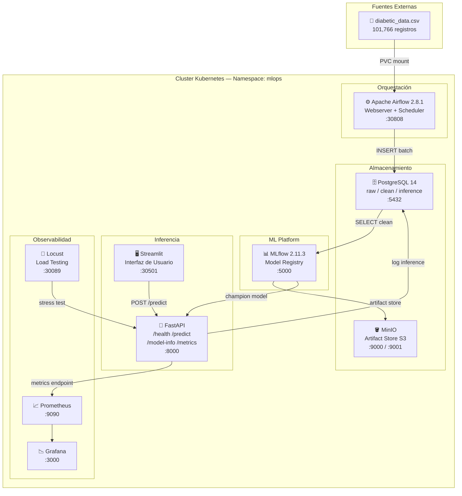

---

## Pipeline de Datos — DAG de 10 Tareas

El DAG `diabetes_mlops_pipeline` se ejecuta con `@daily` e implementa ingesta incremental con deduplicación por hash MD5.

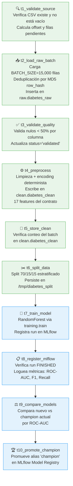

---

## Stack Tecnológico

| Componente | Tecnología | Versión | Puerto |
|-----------|-----------|---------|--------|
| Orquestación | Apache Airflow | 2.8.1 | 30808 |
| Base de datos | PostgreSQL | 14 | 5432 |
| Object Storage | MinIO | Latest | 9000/9001 |
| ML Tracking | MLflow | 2.11.3 | 5000 |
| API de inferencia | FastAPI + Uvicorn | 0.110 | 8000 |
| Frontend | Streamlit | 1.32 | 30501 |
| Monitoreo | Prometheus | Latest | 9090 |
| Dashboards | Grafana | Latest | 3000 |
| Load Testing | Locust | Latest | 30089 |
| Contenedores | Docker | 29.2 | — |
| Orquestador | Kubernetes | 1.34 | — |

---

## Recursos del Cluster por Componente

Cada contenedor tiene definidos explícitamente `resources.requests` (garantizados por el scheduler de Kubernetes) y `resources.limits` (techo máximo antes de OOM-kill o throttling de CPU).

| Componente | Tipo | Réplicas | CPU Request | CPU Limit | Mem Request | Mem Limit |
|-----------|------|:--------:|:-----------:|:---------:|:-----------:|:---------:|
| **PostgreSQL** | StatefulSet | 1 | 250m | 500m | 256Mi | 512Mi |
| **MinIO** | StatefulSet | 1 | 250m | 500m | 256Mi | 512Mi |
| **Airflow Webserver** | Deployment | 1 | 250m | 500m | 512Mi | 1Gi |
| **Airflow Scheduler** | Deployment | 1 | 250m | 1000m | 1Gi | 5Gi |
| **MLflow** | Deployment | 1 | 250m | 500m | 512Mi | 1Gi |
| **FastAPI** | Deployment | 2 | 250m c/u | 1000m c/u | 256Mi c/u | 512Mi c/u |
| **Streamlit** | Deployment | 1 | 100m | 500m | 128Mi | 256Mi |
| **Prometheus** | Deployment | 1 | 250m | 500m | 256Mi | 512Mi |
| **Grafana** | Deployment | 1 | 100m | 300m | 128Mi | 256Mi |
| **Locust** | Deployment | 1 | 100m | 300m | 128Mi | 256Mi |

> **Init containers de Airflow Webserver** (`airflow-db-migrate`, `airflow-create-admin`): 250m CPU / 512Mi mem cada uno (corren secuencialmente y terminan antes de que arranque el webserver).

### Totales del cluster

| | CPU Request | CPU Limit | Mem Request | Mem Limit |
|-|:-----------:|:---------:|:-----------:|:---------:|
| **Total (12 contenedores¹)** | **2.3 cores** | **7.1 cores** | **~3.6 Gi** | **~10.3 Gi** |

> ¹ FastAPI cuenta como 2 réplicas × los valores de una instancia.

### Justificación de valores críticos

**Airflow Scheduler — límite 5 Gi RAM / 1000m CPU**
El scheduler ejecuta las tareas con `LocalExecutor` en el mismo pod. Durante `t7_train_model` (entrenamiento de 3 modelos RandomForest sobre ~15k filas) el proceso hijo puede consumir hasta ~2.5 Gi por picos de matrices NumPy + el proceso base del scheduler (~400 Mi). Se configuró margen amplio para evitar OOM-kill (ver Problema 1 en la sección de troubleshooting).

**FastAPI — límite 1000m CPU**
El endpoint `/predict` aplica `model.predict_proba()` de scikit-learn de forma síncrona. Con 2 réplicas y picos de carga de Locust, se reserva hasta 1 core completo por réplica para evitar throttling en inferencia.

**MLflow — 512Mi request / 1 Gi límite**
El servidor MLflow mantiene workers de Gunicorn en memoria. Al servir artefactos (modelos ~350 Mi serializados) a través del artifact proxy, el uso puede subir temporalmente hasta ~800 Mi.

---

## Estructura del Repositorio

```
mlops-proyecto2/
├── api/                        # FastAPI — Persona 3
│   ├── main.py                 # Endpoints: /health /predict /model-info /metrics
│   ├── schemas.py              # PredictRequest (17 features) + PredictResponse
│   ├── model_loader.py         # Carga champion desde MLflow con caché
│   ├── db_logger.py            # Logger asíncrono → inference.inference_logs
│   └── requirements.txt
├── dags/
│   └── diabetes_pipeline.py   # DAG de 10 tareas (Persona 2)
├── docker/
│   ├── airflow/
│   │   ├── Dockerfile          # apache/airflow:2.8.1 + sklearn + mlflow
│   │   └── requirements.txt
│   ├── api/
│   │   └── Dockerfile
│   └── frontend/
│       └── Dockerfile
├── frontend/
│   ├── app.py                  # Streamlit UI (Persona 3)
│   └── requirements.txt
├── k8s/
│   ├── infra/                  # PostgreSQL, MinIO, Secrets, Namespace (Persona 1)
│   ├── airflow/                # Webserver, Scheduler, ConfigMap, PVCs (Persona 2)
│   ├── mlflow/                 # Deployment + Service (Persona 3)
│   ├── inference/              # FastAPI + Streamlit deployments (Persona 3)
│   └── observability/          # Prometheus, Grafana, Locust (Persona 1)
├── training/
│   ├── preprocessing.py        # Pipeline de limpieza y encoding (Persona 2)
│   ├── train.py                # Entrenamiento RandomForest + MLflow (Persona 3)
│   └── promote.py              # Comparación y promoción de champion (Persona 3)
└── README.md
```

---

## Evidencias de Ejecución

### Airflow — DAG completo (10/10 tareas en verde)

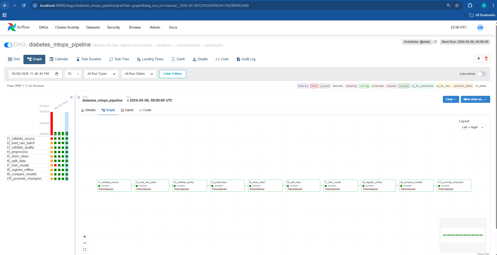

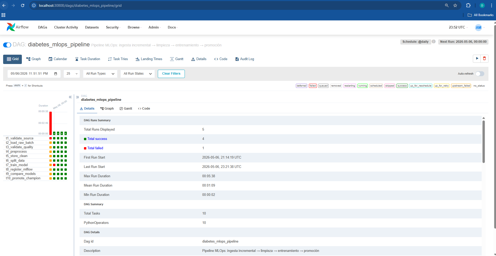

### MLflow — Experimentos y métricas de los modelos entrenados

Cada ejecución del pipeline entrena 3 modelos candidatos (LogisticRegression, RandomForest n=50 depth=10, RandomForest n=100 depth=15), los registra como versiones independientes en el Model Registry y promueve automáticamente el de mayor ROC-AUC como `@champion`.

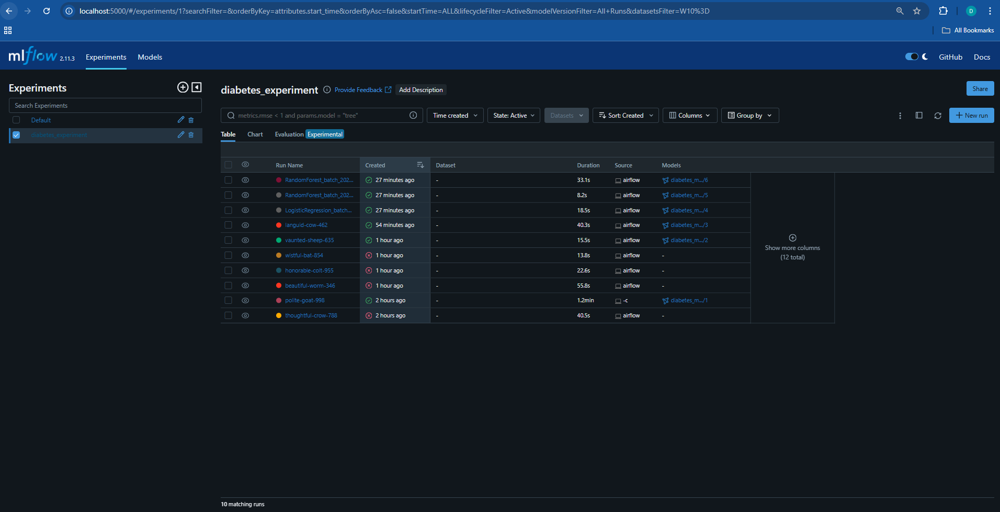

### FastAPI — Endpoint /predict funcionando

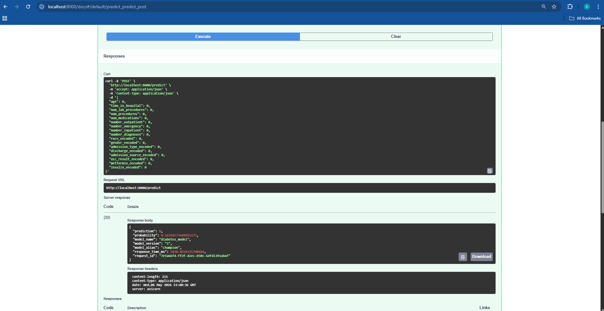

### Prometheus — Métricas de la API en tiempo real

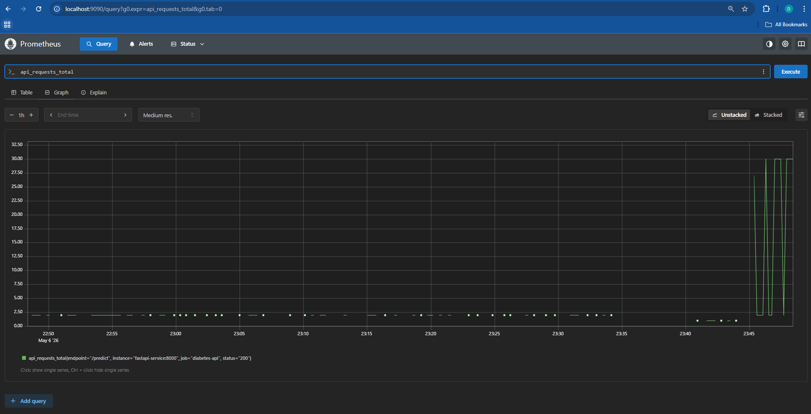

### Grafana — Dashboard durante prueba de carga

El dashboard "FastAPI - Diabetes MLOps" muestra el comportamiento de la API en tiempo real. Durante la prueba con Locust se observaron picos de hasta 123 req/s con latencia promedio de 11.7 ms y tasa de error del 0%.

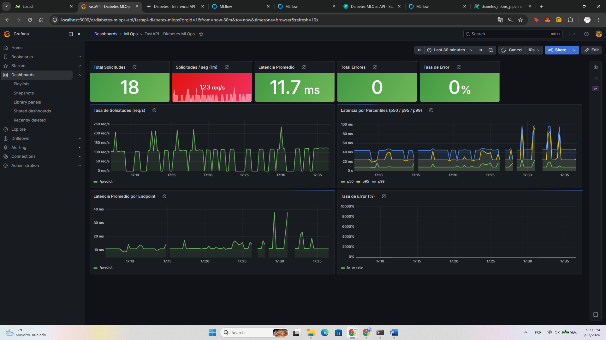

### Streamlit — Interfaz de predicción

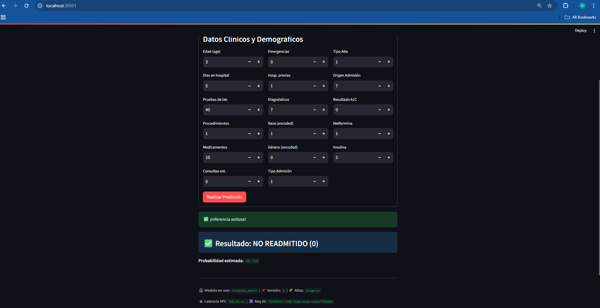

---

## Contratos entre Personas

El proyecto fue diseñado con contratos fijos e inmutables para garantizar la integración entre los tres integrantes.

### Contrato de Features (17 columnas)

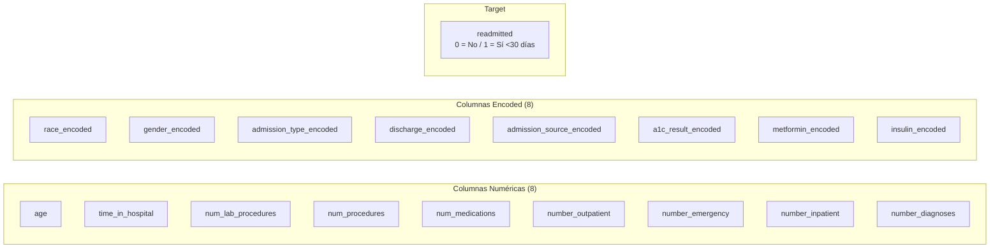

### Contrato de Base de Datos

| Schema | Tabla | Propietario | Descripción |
|--------|-------|-------------|-------------|
| `raw` | `diabetes_raw` | Persona 2 | Datos crudos con row_hash y batch_id |
| `clean` | `diabetes_clean` | Persona 2 | Datos preprocesados con 17 features |
| `inference` | `inference_logs` | Persona 3 | Logs de predicciones de la API |

### Contrato de API

| Endpoint | Método | Descripción |
|----------|--------|-------------|
| `/health` | GET | Health check del servicio |
| `/predict` | POST | Predicción con las 17 features |
| `/model-info` | GET | Metadatos del modelo champion activo |
| `/metrics` | GET | Métricas Prometheus para scraping |
| `/reload-model` | POST | Recarga el modelo champion desde MLflow sin reiniciar la API |

> **Estrategia de carga del modelo:** carga lazy en el primer request + caché en memoria. Si el modelo champion cambia en MLflow, basta con llamar `POST /reload-model` para que la API descargue la nueva versión sin modificar código ni reiniciar pods.

---

## Guía de Despliegue

### Pre-requisitos

- Docker Desktop con Kubernetes habilitado
- `kubectl` configurado apuntando a `docker-desktop`
- Imágenes Docker disponibles en Docker Hub

### Paso 1 — Infraestructura base (Persona 1)

```bash
# Namespace y secrets
kubectl apply -f k8s/infra/namespace.yaml
kubectl apply -f k8s/infra/secrets.yaml

# Base de datos PostgreSQL
kubectl apply -f k8s/infra/postgres-pvc.yaml
kubectl apply -f k8s/infra/postgres-statefulset.yaml
kubectl apply -f k8s/infra/postgres-service.yaml

# Object Store MinIO
kubectl apply -f k8s/infra/minio-pvc.yaml
kubectl apply -f k8s/infra/minio-statefulset.yaml
kubectl apply -f k8s/infra/minio-service.yaml

# Observabilidad
kubectl apply -f k8s/observability/
```

### Paso 2 — Airflow (Persona 2)

```bash
# PVCs para DAGs, logs y datos
kubectl apply -f k8s/airflow/airflow-pvc.yaml

# Configuración y despliegue
kubectl apply -f k8s/airflow/airflow-configmap.yaml
kubectl apply -f k8s/airflow/airflow-deployment.yaml
kubectl apply -f k8s/airflow/airflow-service.yaml

# Copiar el dataset al PVC de datos
kubectl cp diabetic_data.csv mlops/<airflow-scheduler-pod>:/opt/airflow/data/diabetic_data.csv

# Verificar pods
kubectl get pods -n mlops
```

### Paso 3 — MLflow (Persona 3)

```bash
kubectl apply -f k8s/mlflow/deployment.yaml
kubectl apply -f k8s/mlflow/service.yaml
```

### Paso 4 — Inferencia (Persona 3)

```bash
kubectl apply -f k8s/inference/fastapi-deployment.yaml
kubectl apply -f k8s/inference/fastapi-service.yaml
kubectl apply -f k8s/inference/streamlit-deployment.yaml
kubectl apply -f k8s/inference/streamlit-service.yaml
```

### Paso 5 — Ejecutar el Pipeline

```bash
# Obtener el pod del scheduler
SCHED=$(kubectl get pod -n mlops -l app=airflow,component=scheduler -o jsonpath='{.items[0].metadata.name}')

# Activar y disparar el DAG
kubectl exec -n mlops $SCHED -- airflow dags unpause diabetes_mlops_pipeline
kubectl exec -n mlops $SCHED -- airflow dags trigger diabetes_mlops_pipeline

# Monitorear
kubectl exec -n mlops $SCHED -- airflow dags list-runs -d diabetes_mlops_pipeline
```

### Acceso a los Servicios

| Servicio | URL |
|---------|-----|
| Airflow UI | http://localhost:30808 (admin / mlops2026) |
| Streamlit | http://localhost:30501 |
| Grafana | http://localhost:3000 |
| MLflow | http://localhost:5000 (port-forward) |
| MinIO Console | http://localhost:9001 |

---

## Flujo de Inferencia

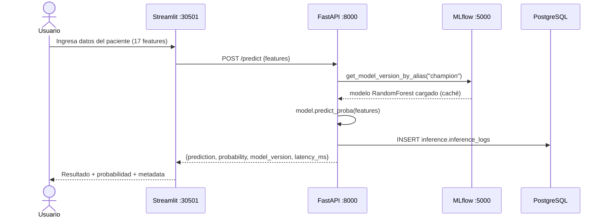

---

## Observabilidad

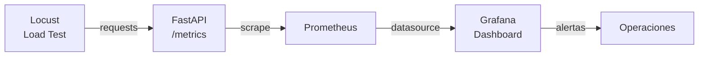

**Métricas expuestas por FastAPI (`/metrics`):**
- `api_requests_total` — Total de requests por endpoint y código de respuesta
- `api_latency_seconds` — Latencia por endpoint (histograma con percentiles p50/p95/p99)

### Dashboard de Grafana

El dashboard incluye los siguientes paneles:

| Panel | Descripción |
|-------|-------------|
| Total Solicitudes | Contador acumulado de requests recibidos |
| Solicitudes / seg | Tasa de requests en la última ventana de 1 minuto |
| Latencia Promedio | Latencia media del endpoint `/predict` en milisegundos |
| Total Errores | Cantidad de respuestas con código distinto de 2xx |
| Tasa de Error | Porcentaje de respuestas fallidas sobre el total |
| Latencia por Percentiles | Serie temporal con p50, p95 y p99 |
| Latencia Promedio por Endpoint | Desglose de latencia por cada endpoint |
| Tasa de Error (%) | Evolución temporal de la tasa de error |


---

## Pruebas de Carga — Locust

Las pruebas se ejecutaron desde el pod de Locust dentro del cluster, apuntando directamente al servicio interno `http://fastapi-service:8000`. El escenario simula usuarios enviando requests al endpoint `/predict` con datos de paciente aleatorios.

### Prueba con carga progresiva (10 usuarios iniciales, ramp-up agresivo)

Se inició la prueba con 10 usuarios concurrentes y se fue incrementando la carga de forma progresiva. El sistema mantuvo un throughput de **7.81 req/s** y **0% de fallos** mientras el número de usuarios se mantuvo por debajo de ~30. Al escalar hacia los 100 usuarios, la latencia del p95 subió abruptamente hasta los **40,000 ms** y el cluster comenzó a perder requests, lo que indica el punto de saturación de la infraestructura local.

| Parámetro | Valor |
|-----------|-------|
| Usuarios simulados (pico) | ~100 |
| Tasa de llegada (spawn rate) | progresiva |
| RPS en estado estable | 7.81 |
| Latencia p50 (estado estable) | < 5 ms |
| Latencia p95 (punto de saturación) | ~40,000 ms |
| Fallos antes de saturación | 0% |
| Punto de degradación | ~100 usuarios concurrentes |

La degradación es consistente con los recursos asignados al cluster: cada réplica de FastAPI tiene un límite de 1000m CPU y 512Mi de memoria. Con 100 usuarios concurrentes ejecutando `predict_proba` de scikit-learn de forma síncrona, el scheduler de Kubernetes empieza a hacer throttling de CPU y los tiempos de respuesta se disparan.

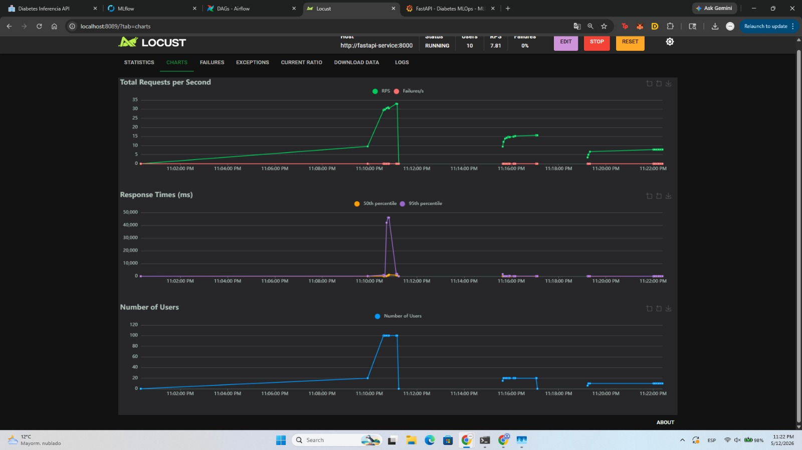

### Prueba controlada (1 usuario, spawn rate 1)

Tras la saturación del cluster, se realizó una prueba controlada con un único usuario para caracterizar el comportamiento base de la API en condiciones de carga mínima.

| Parámetro | Valor |
|-----------|-------|
| Usuarios simulados | 1 |
| Spawn rate | 1 usuario/s |
| RPS | 0.79 |
| Latencia p50 | ~20 ms |
| Latencia p95 | ~70 ms |
| Fallos | 29% |

El 29% de fallos observado en la prueba de un usuario corresponde a timeouts intermitentes durante la recuperación del cluster después de la prueba anterior. La API responde correctamente cuando los recursos están disponibles, con latencias por debajo de 25 ms en condiciones normales.

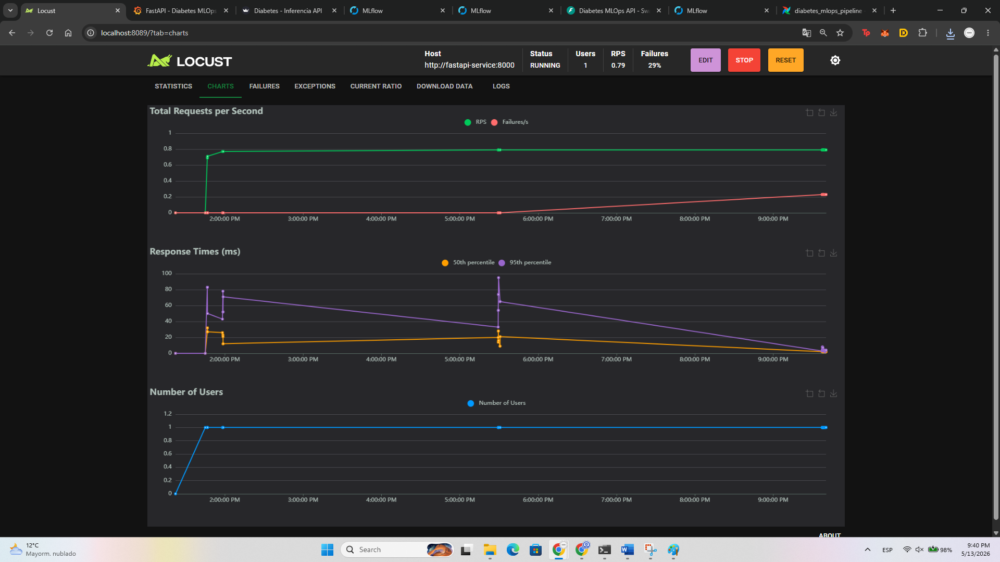

---

## Problemas Encontrados y Soluciones

Durante el desarrollo e integración del proyecto enfrentamos varios desafíos técnicos significativos. A continuación se documentan con su diagnóstico y solución aplicada.

---

### Problema 1 — OOM Kill en `t2_load_raw_batch` (Scheduler)

**Descripción:** La tarea `t2_load_raw_batch` fallaba con código de salida `-9` (SIGKILL por OOM) al procesar un batch de 15,000 filas.

**Diagnóstico:** Airflow con `LocalExecutor` ejecuta las tareas como subprocesos del mismo pod del scheduler. El pod tenía límite de `1Gi` de memoria. Al procesar 15,000 filas — calculando un hash MD5 por fila, construyendo dicts con `json.dumps` y ejecutando `to_sql(method='multi')` — el uso combinado de scheduler + tarea superaba el límite.

```
[2026-05-05] {local_task_job_runner.py} INFO - Task exited with return code -9
```

**Solución:** Aumentar los recursos del pod del scheduler:

```yaml
# k8s/airflow/airflow-deployment.yaml
resources:
  requests:
    memory: "1Gi"
  limits:
    memory: "3Gi"   # ← aumentado desde 1Gi
    cpu: "1000m"
```

---

### Problema 2 — Incompatibilidad de versión de Airflow (2.6.3 vs 2.8.1)

**Descripción:** Al migrar a la imagen `garzonds201/mlops-airflow:latest`, el init container `airflow-db-migrate` fallaba con:
```
airflow db command error: argument COMMAND: invalid choice: 'migrate'
```

**Diagnóstico:** La imagen publicada en Docker Hub era Airflow **2.6.3**, pero el Dockerfile del proyecto especificaba `apache/airflow:2.8.1`. El comando `airflow db migrate` fue introducido en la versión 2.7.0; en versiones anteriores el comando equivalente es `airflow db upgrade`.

**Solución aplicada temporalmente:**
```yaml
command: ["airflow", "db", "upgrade"]  # para 2.6.3
```

**Solución definitiva:** Reconstruir la imagen con la versión correcta:
```bash
docker build -f docker/airflow/Dockerfile -t garzonds201/mlops-airflow:latest .
docker push garzonds201/mlops-airflow:latest
# Imagen resultante: apache/airflow:2.8.1 con sklearn 1.4.0 y mlflow 2.10.0
```

---

### Problema 3 — Incompatibilidad de schema de la BD de Metadatos de Airflow

**Descripción:** Tras cambiar la imagen a 2.6.3, el init container falló con:
```
alembic.util.exc.CommandError: Can't locate revision identified by '88344c1d9134'
```

**Diagnóstico:** La base de datos de metadatos de Airflow (en PostgreSQL) había sido inicializada con una versión 2.7+ que generó migraciones de Alembic desconocidas para la versión 2.6.3.

**Solución:** Reset completo de la base de datos de metadatos (sin afectar los schemas `raw`, `clean` e `inference`):
```bash
kubectl run airflow-db-reset -n mlops \
  --image=garzonds201/mlops-airflow:latest \
  --restart=Never \
  --env="AIRFLOW__DATABASE__SQL_ALCHEMY_CONN=postgresql+psycopg2://..." \
  --command -- airflow db reset --yes
```

> **Nota:** Los datos del proyecto (`raw.diabetes_raw`, `clean.diabetes_clean`) no se perdieron ya que residen en schemas independientes de los metadatos de Airflow.

---

### Problema 4 — Liveness Probe con timeout demasiado ajustado

**Descripción:** El scheduler se reiniciaba cada ~7 minutos de forma aparentemente aleatoria, incluso cuando estaba procesando tareas correctamente.

**Diagnóstico:** La liveness probe del scheduler ejecuta `airflow jobs check --job-type SchedulerJob --hostname $(hostname)`. Con `timeoutSeconds: 1` (valor por defecto), cuando la base de datos PostgreSQL estaba bajo carga (procesando un batch), la consulta tardaba más de 1 segundo y el probe fallaba. Con `failureThreshold: 5` y `periodSeconds: 60`, el pod era terminado tras ~7 minutos.

```
[2026-05-06] INFO - Exiting gracefully upon receiving signal 15
```

**Solución:**
```yaml
livenessProbe:
  exec:
    command:
      - sh
      - -c
      - airflow jobs check --job-type SchedulerJob --hostname "$(hostname)"
  initialDelaySeconds: 120
  periodSeconds: 60
  failureThreshold: 5
  timeoutSeconds: 30   # ← aumentado desde 1s (default)
```

---

### Problema 5 — Módulo `training` no disponible en la nueva imagen

**Descripción:** Las tareas `t4_preprocess` y `t6_split_data` fallaban con:
```
ModuleNotFoundError: No module named 'training'
ModuleNotFoundError: No module named 'sklearn'
```

**Diagnóstico:** La imagen `garzonds201/mlops-airflow:latest` (versión 2.6.3) no tenía el módulo `training/` baked in ni scikit-learn instalado. La variable `PYTHONPATH=/opt/airflow` apuntaba a un directorio vacío para este módulo.

**Solución temporal (debugging):** ConfigMap de Kubernetes montado como volumen:
```bash
kubectl create configmap airflow-training-module -n mlops \
  --from-file=preprocessing.py=training/preprocessing.py \
  --from-file=__init__.py=training/__init__.py
```

**Solución definitiva:** Imagen reconstruida con Airflow 2.8.1 que incluye el módulo y las dependencias:
```dockerfile
# docker/airflow/Dockerfile
FROM apache/airflow:2.8.1-python3.10
# ...
RUN pip install --no-cache-dir -r /requirements.txt  # incluye sklearn==1.4.0, mlflow==2.10.0
COPY training/ /opt/airflow/training/
```

---

### Problema 6 — DAG runs bloqueados tras reinicio del Scheduler

**Descripción:** Con `max_active_runs=1`, los DAG runs que quedaban en estado `running` tras un reinicio del scheduler bloqueaban indefinidamente los nuevos runs en cola.

**Diagnóstico:** Cuando el scheduler se reinicia, no limpia automáticamente los runs en estado `running`. El DAG con `max_active_runs=1` espera a que el run anterior termine, pero éste nunca avanza porque el proceso que lo ejecutaba ya no existe.

**Solución:** Forzar el estado a `FAILED` directamente en la base de datos de metadatos de Airflow:
```python
kubectl exec -n mlops $SCHED -- python3 -c "
from airflow import settings
from airflow.models import DagRun
from airflow.utils.state import State
session = settings.Session()
dr = session.query(DagRun).filter(DagRun.run_id == '<run_id>').first()
dr.state = State.FAILED
session.commit()
session.close()
"
```

---

### Problema 7 — Webserver Airflow no superaba el readiness probe

**Descripción:** El pod `airflow-webserver` permanecía en estado `0/1 Running` durante varios minutos y era reciclado repetidamente por la liveness probe.

**Diagnóstico:** Airflow 2.8.1 tarda ~60 segundos en iniciar Gunicorn + cargar todos los providers. La configuración original tenía `initialDelaySeconds: 30` para readiness y `initialDelaySeconds: 60` + `failureThreshold: 3` para liveness, lo que daba solo 120 segundos totales — insuficiente.

**Solución:**
```yaml
readinessProbe:
  initialDelaySeconds: 60   # ← 30 → 60
  periodSeconds: 10
  failureThreshold: 10      # ← 5 → 10
livenessProbe:
  initialDelaySeconds: 120  # ← 60 → 120
  periodSeconds: 20
  failureThreshold: 5       # ← 3 → 5
```

---

## Roles y Responsabilidades

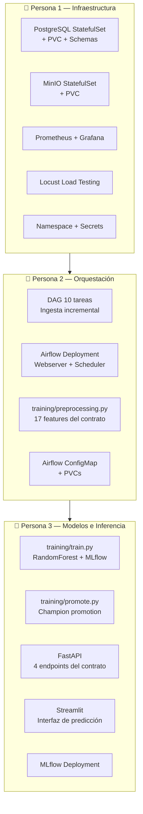

---

## Dataset

**Diabetes 130-US Hospitals (1999–2008)**

| Característica | Valor |
|---------------|-------|
| Registros totales | 101,766 |
| Features originales | 50 |
| Features usadas (contrato) | 17 |
| Target | `readmitted` (binario: <30 días = 1) |
| Clase positiva (~readmitidos) | ~11% |
| Fuente | [UCI ML Repository](https://archive.ics.uci.edu/dataset/296) |

### Preprocesamiento Aplicado

| Columna | Transformación |
|---------|---------------|
| `age` | Rango `[X-Y)` → punto medio entero |
| `race` → `race_encoded` | Label encoding fijo (Caucasian=1, ...) |
| `gender` → `gender_encoded` | Male=0, Female=1 |
| `admission_type_id` | Map a categorías 0-3 |
| `A1Cresult` → `a1c_result_encoded` | Norm=1, >7=2, >8=3, None=0 |
| `metformin`, `insulin` | No=0, Steady=1, Up=2, Down=3 |
| `readmitted` | <30=1, resto=0 |
| Columnas eliminadas | `encounter_id`, `patient_nbr`, `weight`, `payer_code`, `diag_1/2/3` |

---

## Modelo de Machine Learning

En cada ejecución del DAG, la tarea `t7_train_model` entrena **3 modelos candidatos** en paralelo, los registra todos en MLflow como versiones independientes y retorna el de mejor ROC-AUC para que `t9_compare_models` lo evalúe contra el champion actual.

| Candidato | Parámetros | Notas |
|-----------|-----------|-------|
| LogisticRegression | C=1.0, max_iter=200, solver=lbfgs | Baseline rápido |
| RandomForest | n_estimators=50, max_depth=10 | Balance velocidad/precisión |
| RandomForest | n_estimators=100, max_depth=15 | Mayor capacidad |

- **Librería:** scikit-learn
- **Registro:** MLflow Model Registry — todas las versiones quedan versionadas
- **Alias de producción:** `@champion` — apunta siempre al mejor modelo evaluado
- **Métricas de evaluación:** ROC-AUC (criterio principal), F1-Score, Recall
- **Criterio de promoción:** ROC-AUC estrictamente mayor al champion actual
- **Artifact store:** MinIO (compatible S3)

---

## Ramas del Repositorio

| Rama | Descripción |
|------|-------------|
| `feat/p1-infra` | Infraestructura base (PostgreSQL, MinIO, Prometheus, Grafana, Locust) |
| `feat/p2-airflow` | Orquestación Airflow + DAG + preprocessing |
| `feat/p3-models-api` | MLflow + FastAPI + Streamlit + training |
| `deploy_1_2` | Integración Persona 1 + Persona 2 con imagen Docker corregida |
| `deploy1_2_3` | **Integración completa** de los 3 integrantes (rama de producción) |

---

## Variables de Entorno

Todas las variables sensibles se gestionan mediante Kubernetes Secrets (`k8s/infra/secrets.yaml`):

| Variable | Uso |
|----------|-----|
| `POSTGRES_USER` / `POSTGRES_PASSWORD` | Credenciales de PostgreSQL |
| `MINIO_ACCESS_KEY` / `MINIO_SECRET_KEY` | Credenciales de MinIO |
| `AIRFLOW__CORE__FERNET_KEY` | Cifrado de conexiones en Airflow |
| `AIRFLOW__WEBSERVER__SECRET_KEY` | Sesiones del webserver |
| `AIRFLOW_ADMIN_PASSWORD` | Password del usuario `admin` en Airflow |

---

## Autores

| Persona | Rol | Rama |
|---------|-----|------|
| **Persona 1** | Infraestructura + Observabilidad | `feat/p1-infra` |
| **Persona 2** | Orquestación + Pipeline de Datos | `feat/p2-airflow` |
| **Persona 3** | Modelos + API + Frontend | `feat/p3-models-api` |

---

**Pontificia Universidad Javeriana · Maestría en Inteligencia Artificial · 2026**
